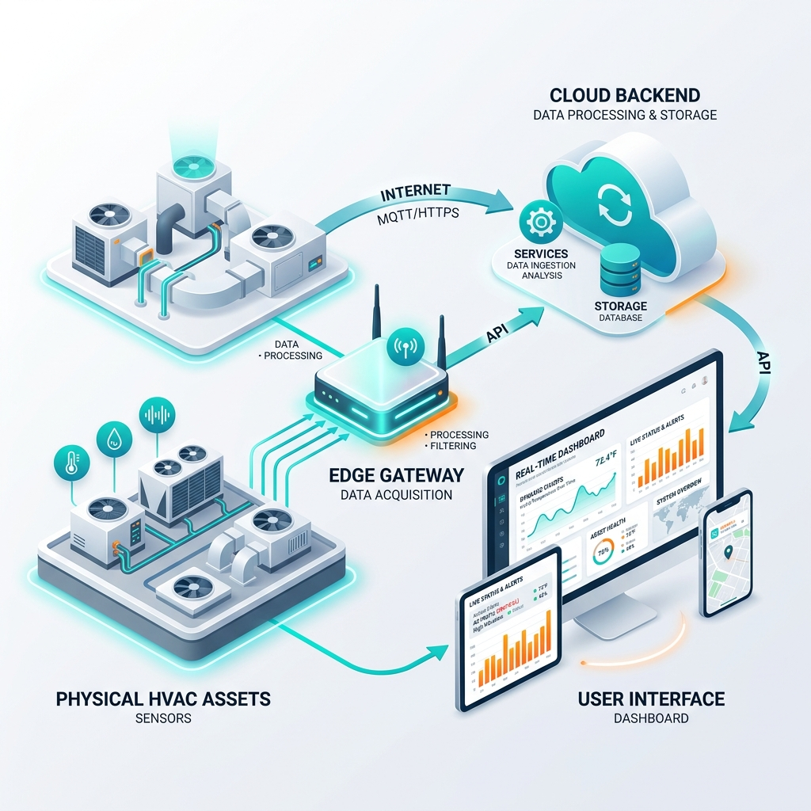

# API Reference - Graylinx

The Graylinx backend provides a wide range of REST APIs for managing the HVAC hierarchy, retrieving telemetry data, and controlling equipment.

## Base Categories

### 1. Hierarchy & Configuration
These APIs manage the organization of locations and devices.
- `GET /v1/organizations`: List all organizations.
- `GET /v1/campuses/:id/tree`: Get the full hierarchy of a campus (Buildings -> Floors -> Zones -> Devices).
- `GET /v1/buildings/:id/floors`: List floors in a specific building.
- `GET /v1/zones/:id/devices`: List all devices within a zone.

### 2. Telemetry & Live Data
- `GET /v1/floors/:id/:deviceType/data`: Retrieve current data for all devices of a specific type on a floor.
- `GET /v1/devices/:id/events`: Get the latest events/readings for a specific device.
- `GET /plantapi`: Returns high-level plant performance metrics (Total KW, BTU TR, iKW/TR).
- `GET /outDoorWeatherApi`: Retrieves current weather conditions from integrated weather services.

### 3. Alarms & Events
- `GET /glAlarm`: List all active alarms.
- `GET /glAlarmCritical`: List only critical alarms (Code 100-299).
- `GET /glAlarmNonCritical`: List non-critical alarms (Code > 300).
- `GET /getIbmsEvents`: Retrieve system events and audit logs.
- `POST /:id/hideEvents`: Acknowledge or hide specific events.

### 4. Control Actions
- `POST /controlaction`: The primary endpoint for manual overrides and control triggers.
- `POST /setpoint`: Update target setpoints for devices (e.g., Temperature, Pressure).
- `POST /autoManualStatus`: Toggle between Automated (CPM) and Manual control modes.
- `POST /controlcoolingtowerfan`: Specific control for cooling tower fans.

### 5. Analytics & Metrics
- `GET /ikw_per_tr`: Historical efficiency data for the last 7 days.
- `GET /cc/totalcount`: Count of devices grouped by their subsystem type.
- `GET /:id/faultTypeCount`: Statistical breakdown of faults for a specific device.

### 6. User & Session
- `GET /v1/users`: List system users.
- `GET /loginLogoutDetails`: Audit trail of user sessions and active time.

## Data Structures
Most APIs return JSON arrays of objects. Time-series data usually includes:
- `measured_time`: ISO timestamp.
- `param_id`: The identifier for the reading (e.g., `temperature`, `power`).
- `param_value`: The actual value recorded.
