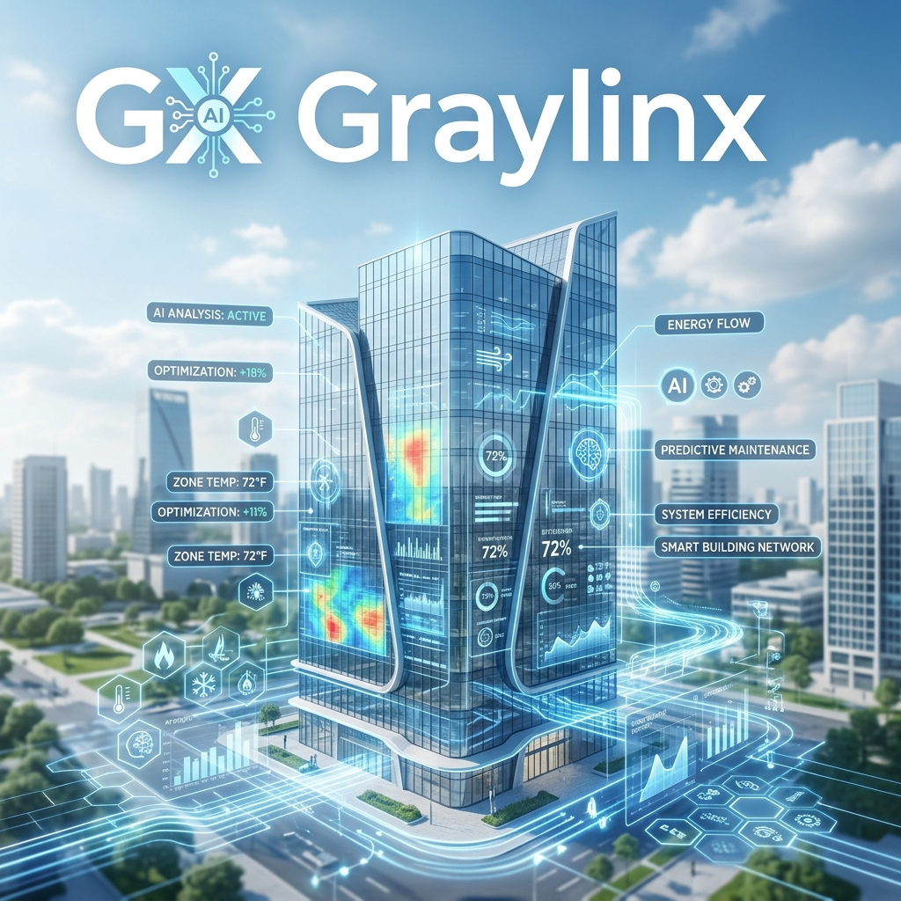

# Graylinx / Jupiter Platform Overview

Graylinx (also referred to as Jupiter) is an advanced integrated Building Management System (iBMS) and HVAC optimization platform. It focuses on energy efficiency, automated control, and real-time monitoring of large-scale cooling and ventilation systems.

## Core Purpose
The primary goal of the system is to optimize the operation of HVAC equipment (Chillers, AHUs, Pumps, Cooling Towers) to reduce energy consumption while maintaining desired environmental conditions (temperature, airflow, etc.).

## Key Features

### 1. Automated Control (CPM)
The **Control Process Module (CPM)** is the heart of the system. It uses a logic engine to:
- Automatically start/stop equipment based on demand.
- Adjust setpoints (e.g., Chilled Water Temperature, Fan Speeds) dynamically.
- Implement "Sequence of Operations" (SoO) for complex plant rooms.
- Handle "Auto/Manual" modes for operator intervention.

### 2. Real-time Monitoring & Telemetry
The system integrates with hardware via the **BACnet protocol** to collect data such as:
- **Energy consumption** (KW, KWH).
- **Thermal loads** (BTU, TR).
- **Equipment status** (On/Off, Faults, VFD speeds).
- **Environmental sensors** (Temperature, Humidity, CO2).

### 3. Alarm Management
Graylinx provides a comprehensive alarm system that:
- Detects equipment faults and operational deviations.
- Categorizes alarms as **Critical** or **Non-Critical**.
- Tracks acknowledgement and restoration by operators.

### 4. Advanced Analytics
- **iKW/TR Performance**: Real-time efficiency metrics for chillers and the entire plant.
- **Run Hour Tracking**: Monitoring equipment usage for preventive maintenance.
- **Heatmaps & Trends**: Visualizing historical data to identify patterns and inefficiencies.

## Target Audience
- Facility Managers
- HVAC Engineers
- Sustainability Officers
- Building Operators

## Tech Stack Summary
- **Backend**: Node.js (Express), MySQL, BACnet stack.
- **Frontend**: React (Material-UI), Chartist/D3 for data visualization.
