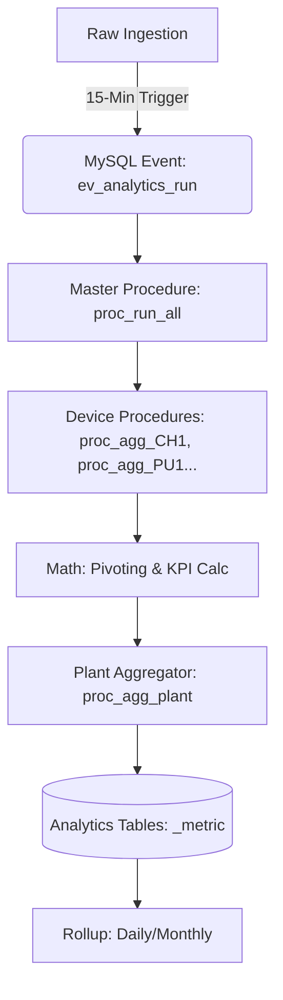

# Graylinx DB Architecture: End-to-End Technical Blueprint

This document provides a comprehensive overview of the current database architecture powering the Graylinx (Jupiter) Industrial IBMS & Energy Management platform.

---

## 🏗️ 1. Architectural Philosophy
The Graylinx data tier is built for **high-throughput telemetry ingestion** and **site-level isolation**. It employs a multi-tenant, sharded approach to ensure performance scalability across multiple industrial installations.

### Key Technologies
- **Primary Database**: MySQL 8.0+ (Relational, Metadata, & Analytics)
- **Time-Series Engine**: InfluxDB (Secondary, for high-frequency sensor streams)
- **Programming Logic**: Stored Procedures & MySQL Events
- **Orchestration**: Node.js Backend (Service Layer)

---

## 📦 2. Data Tier Segregation
The system organizes data into five distinct logical layers to balance write performance and query speed.

### 🏛️ A. Metadata & Hierarchy Layer
Defines the "Digital Twin" of the physical site.
- **Tables**: `organization` → `campus` → `building` → `floor` → `zone`.
- **Equipment Registry**: `gl_subsystem` (Master list of devices) and `gl_parameter` (Data point definitions).
- **Mapping**: `gl_location_subsystem_map` links hardware to spatial locations.

### 📥 B. Raw Ingestion Layer (Sharded EAV)
To prevent table lock-ups and performance degradation, Graylinx uses **Table Sharding per Device**.
- **Naming Convention**: `{TYPE}_{MAC/ID}_om_p` (e.g., `ch_0001b00000_om_p` for Chiller 1).
- **Structure**: Stores raw, timestamped readings in an Entity-Attribute-Value format.

### ⚡ C. Real-Time Snapshot Layer
Optimized for "Instant-On" dashboard loading.
- **`latest_event`**: Stores a JSON-serialized snapshot of the absolute latest readings for every device.
- **`device_status`**: Tracks connectivity heartbeats (Online/Offline/Stale).

### 📈 D. Analytics & Aggregation Layer
Stores processed metrics for long-term charting and reporting.
- **Metric Tables**: `{DEVICE}_metric` stores 15-minute aggregated data (Pivoted values).
- **Rollup Tables**: Daily and monthly summaries for energy consumption and efficiency KPIs.

### 🛡️ E. Operational & Audit Layer
- **`gl_alarm`**: Active fault logs with acknowledgment tracking.
- **`gl_ibms_event`**: Forensic audit trail of system/user actions.
- **`gl_control_command`**: Command queue for downlink control actions.

---

## 🔄 3. The ETL & Analytics Pipeline
The "intelligence" of the database is driven by an internal automation engine.

1.  **Trigger**: A native MySQL Event (`ev_analytics_run`) fires every 15 minutes.
2.  **Transformation**: Stored procedures (generated by the backend) pivot raw EAV data into structured rows.
3.  **Calculations**: Logic inside SQL handles complex HVAC math (e.g., Converting Temperature/Flow into Tons of Refrigeration (TR) and Specific Power (SPC)).
4.  **Loading**: Final results are written to the `_metric` and `rollup` tables for frontend consumption.

---

## 📡 4. End-to-End Data Flow

### 🔵 Inbound (Data In)
`Hardware Gateway` ➔ `Backend API` ➔ `MySQL latest_event` (Real-time) ➔ `Device_om_p` (History).

### 🟢 Outbound (Data Out)
`Frontend UI` ➔ `Backend Service` ➔ `MySQL latest_event` (for Dashboard) OR `Metric Tables` (for Analytics).

### 🔴 Control (Command)
`UI Interaction` ➔ `Backend API` ➔ `gl_control_command` ➔ `Gateway Service` ➔ `Field Hardware`.

---

## ⚠️ 5. Known Limitations & Roadmap
*As documented in [DB_CRITICAL_FLAWS.md](file:///d:/Harshan/graylinx-be/combined_repo/backend/docs/database/DB_CRITICAL_FLAWS.md)*

- **Logic Trap**: Significant math logic is currently embedded in SQL Procedures, making testing and versioning difficult.
- **Scaling**: 1,000+ sharded tables per site can lead to metadata overhead in massive multi-tenant servers.
- **Modernization Plan**: Moving toward a unified `telemetry` table with partitioning and migrating business logic to the Node.js/Python layer.

---
*Created on April 30, 2026 | Graylinx Engineering Documentation*
