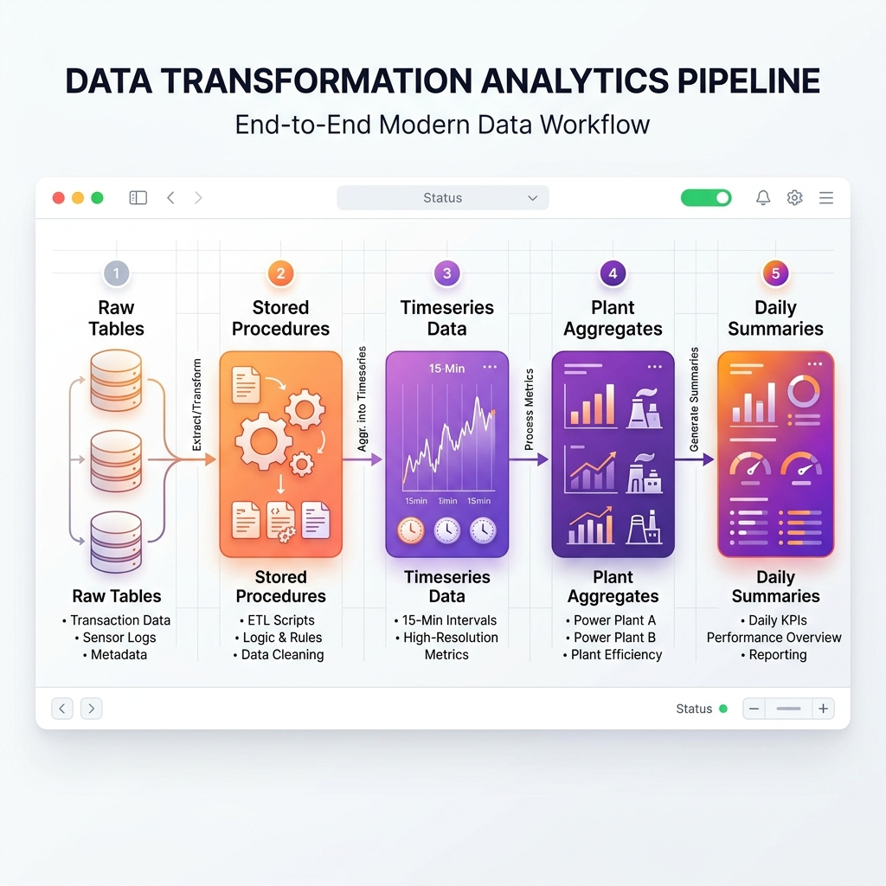

# Analytics Pipeline (Metadata-Driven ETL)

The Analytics Pipeline is the most complex ETL in the system. It transforms raw, asynchronous point data into high-value performance metrics and KPIs.

## Pipeline Flow



## Key Components

### 1. The Metadata: `analytic_report_config.json`
- **Location**: `backend/Services/Gl_reports1/analytic_report_config.json`
- **Purpose**: Defines the logic for every calculation.
    - **Calculations**: Formulas for TR, SPC, etc.
    - **Hierarchy**: Which devices belong to which plant.
    - **Mapping**: Which `param_id` corresponds to which physical metric (e.g., `sts_on_off_00` = `run_status`).

### 2. The Generator: `generateAggregationProcedures.js`
- **Location**: `backend/Services/Gl_reports1/generateAggregationProcedures.js`
- **Purpose**: A script that runs on server startup. It detects changes in the config and regenerates the MySQL stored procedures.
- **Output**: Creates procedures like `proc_agg_CH1`, `proc_agg_plant`, and `proc_rollup_daily`.

### 3. The Orchestrator: MySQL Event Scheduler
- **Trigger**: An internal MySQL Event `ev_analytics_run`.
- **Logic**:
    ```sql
    CREATE EVENT ev_analytics_run
      ON SCHEDULE EVERY 15 MINUTE
      DO CALL proc_run_all();
    ```
- **Execution Order**:
    1.  `proc_agg_{Device}`: Processes raw points into 15-min device metrics.
    2.  `proc_agg_plant`: Sums up device metrics into plant totals.
    3.  `proc_rollup_daily`: Calculates daily averages and totals for reporting.

## Key Transformations

### Time-Bucketing
Raw data arrives at irregular intervals. The ETL groups data into fixed 15-minute windows using a "bucket floor" calculation:
`FROM_UNIXTIME(FLOOR(UNIX_TIMESTAMP(created_at) / 900) * 900)`

### Logic Gating
Metrics like kW and TR are automatically gated by the `run_status`. If a device is OFF, its power consumption is forced to 0 in the analytics layer to prevent sensor noise from corrupting results.

## Output Tables
- **`gl_device_timeseries`**: 15-min resolution metrics (kW, TR, SPC, Run Hours).
- **`gl_plant_timeseries`**: 15-min resolution plant KPIs.
- **`gl_plant_summary`**: Daily KPI rollups (Total kWh, Avg SPC, Peak TR).
