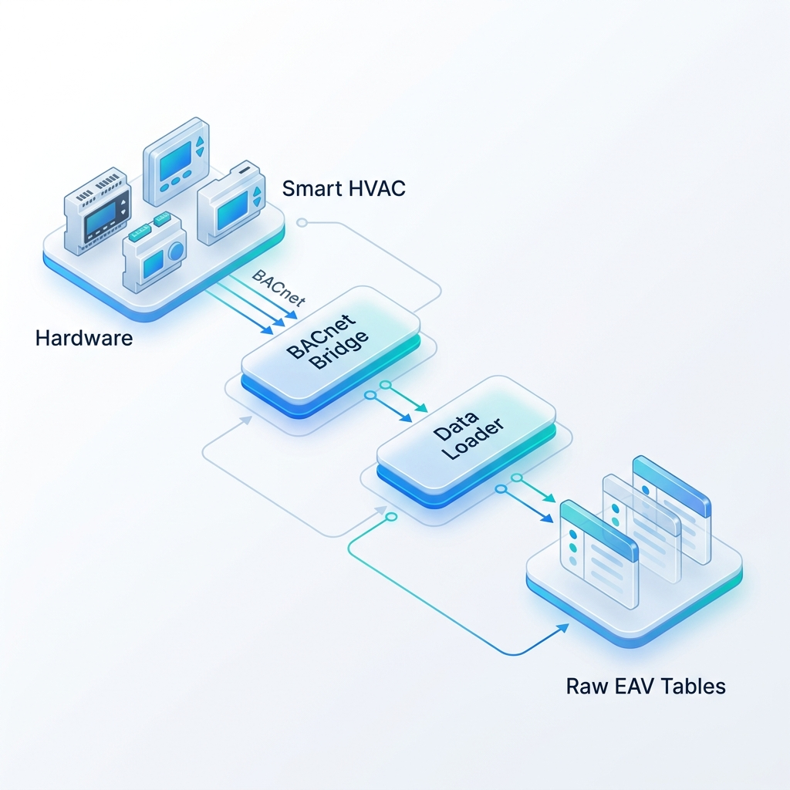

# Ingestion Pipeline (Data Extraction)

The Ingestion Pipeline is responsible for extracting sensor and status data from physical HVAC controllers and energy meters, and loading it into the "Raw" database layer.

## Pipeline Flow

## Key Components

### 1. Extractor: `dataLoader.js`
- **Location**: `backend/Apps/dataLoader/dataLoader.js`
- **Trigger**: Runs on a `setInterval` loop (typically every 15 minutes).
- **Process**:
    1.  Calls `controller.instancesInfo()` to fetch the list of all registered device parameters and their IP addresses.
    2.  Groups parameters by IP address.
    3.  Sends batch requests to the BACnet bridge (`http://localhost:7080/readmultiple`).
    4.  Receives the current values for all requested points.

### 2. Loader: `controller.js`
- **Location**: `backend/Apps/dataLoader/controller.js`
- **Functions**:
    - `insertUpdatePLE()`: Inserts the new values into the device's specific raw table and updates the `latest_event` snapshot.

### 3. Storage: Raw EAV Schema
Data is stored in Entity-Attribute-Value (EAV) tables to support high-frequency writes and flexible point naming.
- **Example Table**: `ch_0001b00000_om_p` (Chiller 1 Raw Data)
- **Columns**: `id`, `param_id`, `param_value`, `created_at`.

## Configuration
- **Interval**: Configured via the `setInterval` logic in `dataLoader.js`.
- **Devices**: Defined in the `gl_subsystem` and `gl_location_subsystem_map` tables.

## Monitoring
Check the `Logs/` directory or the `control.log` for output from the `logger.info("all devices completed storing")` message.
