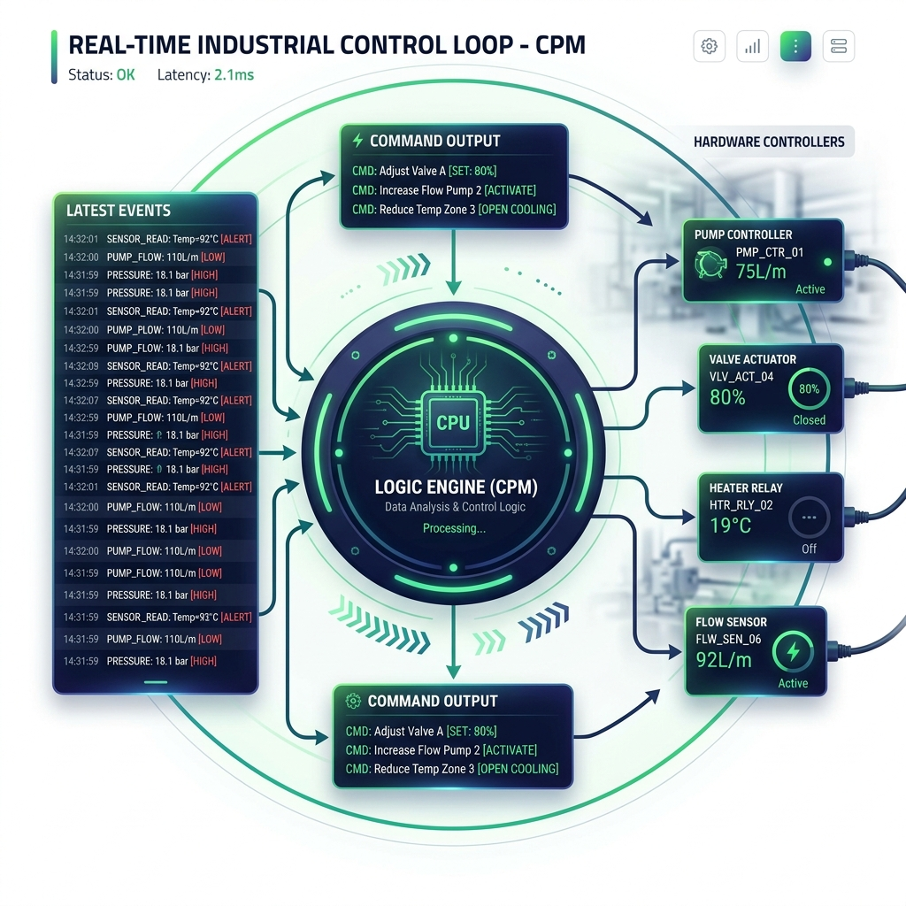

# Operational Pipeline (Control & Real-time)

The Operational Pipeline handles the real-time logic required for HVAC automation, including equipment sequencing, alarm detection, and setpoint adjustments.

## Pipeline Flow

## Key Components

### 1. The Decision Engine: CPM (Control Process Module)
- **Location**: `backend/CPM/decision_engine.js`
- **Trigger**: Runs every 15 seconds (initiated by `runCPM()` in `app.js`).
- **Process**:
    1.  Reads the "Latest Event" snapshot from the database.
    2.  Evaluates control strategies (e.g., Lead-Lag sequencing, Temperature Optimization).
    3.  Determines which equipment should be ON/OFF and at what setpoint.
    4.  Writes the desired state back to the `gl_subsystem` or specific command tables.

### 2. The Alarm Module
- **Location**: `backend/control_module/alarm_module.js`
- **Trigger**: Runs every 5 seconds (initiated by `runAlarms()` in `app.js`).
- **Process**:
    1.  Scans raw data for values outside of safety thresholds.
    2.  Detects "Fault" statuses from the hardware.
    3.  Inserts entries into the `gl_alerts` table and triggers notifications.

### 3. The Scheduler
- **Location**: `backend/control_module/schedules.js`
- **Purpose**: Evaluates time-of-day and holiday schedules to override CPM decisions or set target operating modes.

## Data Points
- **Input**: Real-time snapshots from `latest_event`.
- **Output**: Control commands stored in `gl_subsystem` or specialized command tables (e.g., `sts_on_off_00` command points).

## Configuration
Control thresholds and setpoints are often configured in the `Config/` directory or directly in the `gl_subsystem` metadata.
