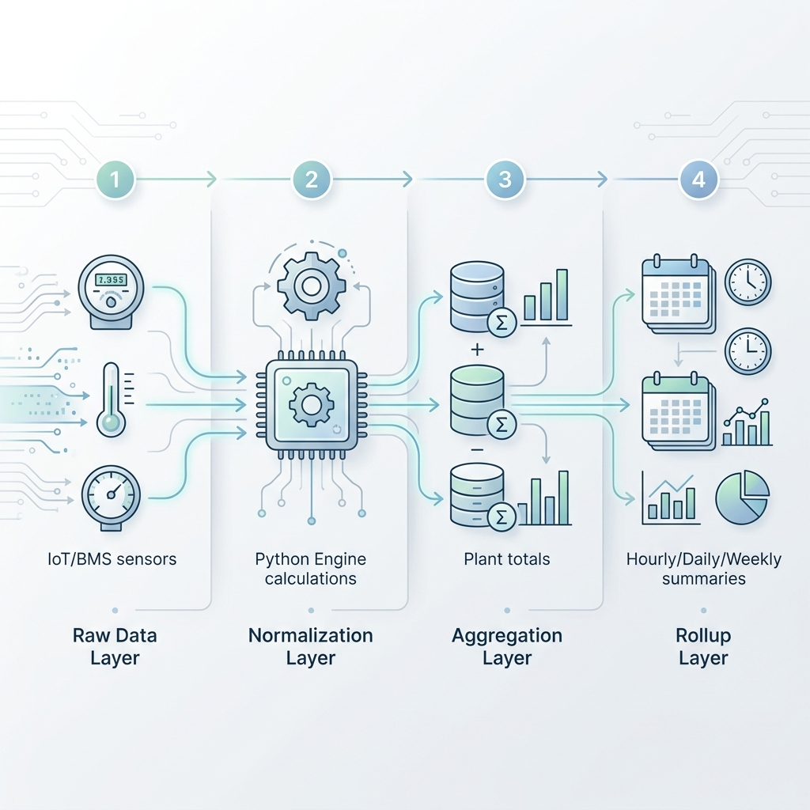

# GL Analytics ETL — Comprehensive Technical Guide

This document provides an end-to-end technical reference for the **Python Energy Analytics ETL**. It is designed for developers, architects, and data engineers who need to maintain, optimize, or extend the pipeline.

---

## 1. Project Mission & Performance
The GL Analytics ETL is a high-speed data processing engine that transforms raw BMS/IoT sensor data into high-integrity energy metrics. It replaces a legacy Node.js implementation with a Python-based asynchronous architecture.

### Performance Benchmark
*   **Legacy Node.js**: 3–4 hours for a 6-month backfill.
*   **Python ETL**: 1–5 minutes for the same range (~50-200x speedup).
*   **Bottleneck Resolution**: Eliminates the "one-query-per-slot" bottleneck by using bulk memory-resident processing.

---

## 2. Technical Stack
- **Language**: Python 3.10+
- **Concurrency**: `asyncio` for non-blocking I/O.
- **Database**: `aiomysql` (Async MySQL Driver).
- **Core Libraries**:
  - `bisect`: For O(log N) in-memory data slicing.
  - `math`: For complex engineering formulas.
  - `logging`: Structured logs for backfill and live runs.

---

## 3. End-to-End Pipeline Architecture

The data travels through four distinct layers, ensuring raw data is never lost and final insights are performant.

### Layered Flow
1.  **Raw Layer (Ingest)**: IoT Gateways push data into `raw_...` or `em_...` tables. Data is stored in "long format" (Time, Param_ID, Value).
2.  **Normalization Layer (Device ETL)**: The core engine fetches raw data, applies time-weighted averaging, runs formulas, and writes to "wide format" device tables (e.g., `ss_chiller_01`).
3.  **Aggregation Layer (Plant ETL)**: Sums up device metrics (Total KW, Total KWH) and calculates plant-wide efficiency (Plant Load, Aux Power).
4.  **Rollup Layer (Temporal)**: Aggregates 5-minute slots into Hourly, Daily, and Weekly summaries for dashboarding.

### Pipeline Visualization

---

## 4. Deep Dive: The Normalization Engine

### A. Time-Weighted Averaging (TWA)
Unlike simple averages, TWA accounts for the duration of a sensor reading.
- **Logic**: If a parameter was `100` for 4 minutes and `0` for 1 minute, the simple average is `50`, but the TWA is `80`.
- **Run-Status Gating**: Metrics like `KW` are only averaged when the device is `ON`. If the device is `OFF`, these metrics are forced to `0` to prevent sensor noise from corrupting energy totals.

### B. Formula Evaluation (Sandbox)
Formulas are defined in `site_config.json` using JavaScript-style syntax.
- **Example**: `tr = flow * (temp_in - temp_out) * 0.33`
- **Security**: The engine (in `calculator/formula.py`) runs in a restricted sandbox with no access to `__builtins__`, file systems, or network.
- **Robustness**: Undefined variables default to `0` instead of crashing the process.

### C. Cumulative Integrity
Energy totals (`cumulative_kwh`) and heat totals (`cumulative_trh`) are "virtual meters."
- **Initialization**: On startup, the ETL reads the *last known* cumulative value from the database.
- **Maintenance**: It adds the current slot's `kwh` to the running total in memory.
- **Persistence**: The updated total is written back. This ensures the virtual meter never resets, even if the physical sensor does.

### D. Warmup & Run Status
- **Warmup Logic**: Respects `warmup_minutes` (e.g., 15 mins). After a device starts, performance metrics (KW/TR) are marked as `is_running = 2` (WARMUP) so they can be excluded from efficiency dashboards until pressures stabilize.
- **Run Status Any**: Allows a device to be considered "ON" if *any* of multiple status parameters (e.g., Run Signal, Motor Current, Frequency) are active.

---

## 5. Optimization Secrets: Why it's 200x Faster

### 1. Bulk Prefetching
Instead of querying the DB for every 5-minute slot, the ETL issues **one query per parameter** for the entire backfill range (e.g., 6 months).
- **Result**: 1 query instead of 50,000 queries.

### 2. O(log N) Slicing
With all raw data in memory, the ETL uses the `bisect` module to find relevant data points for a specific 5-minute window. This is mathematically optimal and eliminates network latency.

### 3. Batch Upserts
Data is not written row-by-row.
- **Batch Size**: 500 rows.
- **SQL**: `INSERT ... ON DUPLICATE KEY UPDATE`.
- **Benefit**: Reduces network round-trips by 99.8%.

---

## 6. Domain Logic: Chiller Performance

The ETL handles advanced chiller efficiency tracking (Committed vs. Actual).

- **The Matrix**: Contains manufacturer-committed ikW/TR values for different **Condenser Leaving Temperatures** and **Chiller Load %**.
- **Lookup**: For every slot, the ETL snaps the actual temperature and load to the nearest matrix coordinates.
- **Deviation**: It calculates exactly how much extra power (kW) the chiller is consuming compared to its design specification.
- **Committed KWh**: The system tracks what the energy consumption *should* have been if the chiller were perfect.

---

## 7. Database & Schema Management

### Dynamic Synchronization
The schema is **not static**. It is driven by `site_config.json`.
- **On Startup**: `schema/manager.py` checks if the physical database columns match the configuration.
- **Auto-Update**: If you add a new parameter (e.g., `vibration_sensor`) to the JSON, the ETL will automatically execute `ALTER TABLE ... ADD COLUMN` on the next run.

### Table Types
- **Normalized Tables**: `ss_<device_name>` — 5-minute resolution.
- **Plant Table**: `ss_plant_normalized` — Aggregate site metrics.
- **Rollup Tables**: `rollup_hourly`, `rollup_daily`, `rollup_weekly`.

---

## 8. Reliability & Operations

### Gap Filling & Lag Blocks
- **Gap Filling**: Every 15 minutes, the live cron job checks for gaps between the last processed slot and the current time.
- **Lag Block**: The ETL intentionally waits (default 15 mins) before processing the latest data to ensure slow BMS systems have finished uploading their readings.

### Smoke Tests
Use `python smoke_tests.py` to:
1.  Verify that Python's formula logic matches the legacy Node.js results.
2.  Test the `bisect` slicing logic with mock data.
3.  Ensure weighted averages handle "off" periods correctly.

### Monitoring
- **`main.log`**: Overall system health.
- **`backfill.log`**: Historical processing speed and progress.
- **`live-cron.log`**: Real-time ingestion status.

---

## 9. Tuning & Configuration

Adjust settings in `.env` to match your hardware:

| Variable | Default | Rationale |
| :--- | :--- | :--- |
| `DEVICE_CONCURRENCY` | `8` | How many devices process in parallel. Increase for many small devices. |
| `INSERT_BATCH_SIZE` | `500` | Rows per SQL write. Increase if DB has large `max_allowed_packet`. |
| `REPROCESS_HOURS` | `24` | How far back to "re-verify" data during every live run. |
| `DB_POOL_MAX` | `30` | Max database connections. |

---

> [!IMPORTANT]
> **Data Integrity Rule**: Always ensure `site_config.json` is backed up. The database schema depends entirely on this file. If the file is lost, the ETL cannot map raw data to normalized columns.
