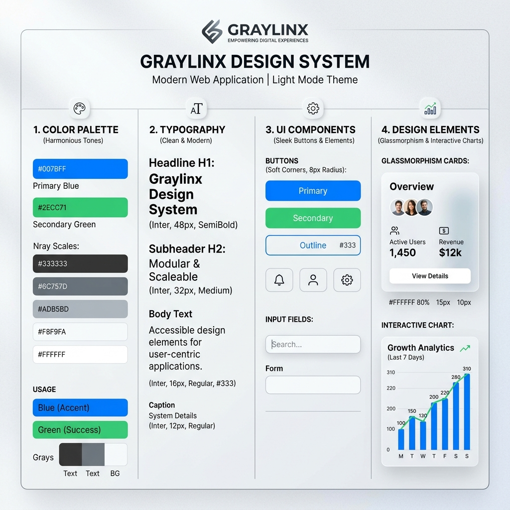

# UI Features - Jupiter Dashboard

The Jupiter UI provides a rich set of features for facility management and HVAC optimization.

## Key Views & Functionalities

### 1. Executive Dashboard
- **Overview Cards**: High-level metrics like Total Plant Power (KW), Total Load (TR), and Overall iKW/TR.
- **System Status**: Real-time indicators of which equipment is running, faulted, or in manual mode.

### 2. Equipment-Specific Dashboards
- **AHU (Air Handling Units)**: Detailed views for airflow, supply/return temperatures, and damper positions.
- **Chiller Plant**: Monitoring of entering/leaving water temperatures, compressor loads (FLA), and specific efficiency metrics for each chiller.
- **VAV (Variable Air Volume)**: Room-level monitoring of occupancy and climate control.

### 3. Analytics & Performance
- **GlAnalytics**: Advanced reporting on energy consumption over days, weeks, or months.
- **Heatmaps**: Visual representation of temperature or occupancy across building floors to identify "hot spots" or wasted energy.
- **Trend Analysis**: Interactive line charts allowing comparison between different parameters (e.g., Outdoor Temp vs. Chiller Load).

### 4. Control Center
- **Scheduler**: Interface for setting weekly operating schedules for equipment to ensure they don't run during unoccupied hours.
- **Manual Overrides**: UI for operators to take manual control of specific points (e.g., forcing a fan to 100% speed).
- **Threshold Config**: Setting upper and lower bounds for alarms (e.g., "Alert me if temperature > 25°C").

### 5. Infrastructure Management
- **Floor Map Generator**: Interactive floor plans showing device locations and live zone status.
- **Network Diagram**: Visualizing the connectivity of gateways and controllers across the site.
- **Parking Solution**: (If enabled) Monitoring of parking occupancy and lighting.

### 6. Notifications & Alerts
- **Real-time Alert Bar**: Immediate feedback when a critical alarm occurs.
- **Alarm History**: A searchable list of past events, allowing operators to see when a fault was detected, acknowledged, and cleared.

## Visual Design
- **Material Design**: Uses Google's Material Design principles for a clean, professional look.
- **Responsive Layout**: Optimized for both desktop monitoring stations and mobile tablets for on-site engineers.
- **Color Coding**:
    - **Green**: Normal / Running.
    - **Red**: Alarm / Fault.
    - **Orange**: Manual Override.
    - **Grey**: Off / Inactive.
